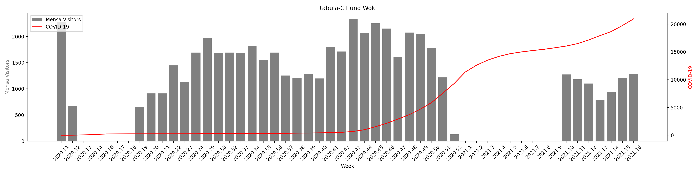
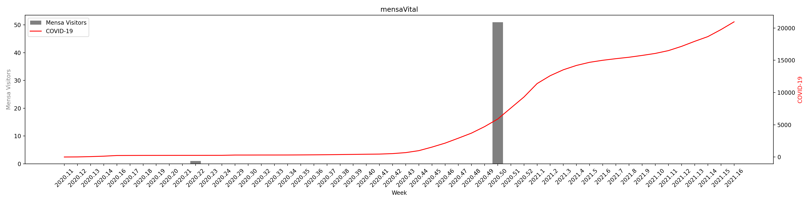
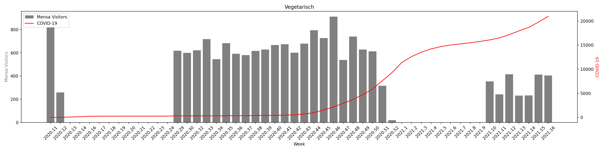

<h1>nerdcup_TUBAF_2021</h1>

<h2>Datenanalyse Event der Technischen Universität Bergakademie Freiberg</h2>

<h3>Aufgabenstellung</h3>

Gegeben waren mehrere Daten verschiedener Arten. Folgende Daten wurden gegeben:

<ul>
    <li>Mensadaten
        <ul>
            <li>Aufläufe und Pizzen</li>
            <li>Mensa Vital</li>
            <li>Selbstauswahltheken, Gemüse, Pasta, etc.</li>
            <li>Wok und Grill</li>
            <li>Vegitarisch</li>
        </ul>
    </li>
    <li>Wetterdaten
        <ul>
            <li>Minutenwerte</li>
            <li>Temperatur</li>
            <li>Luftfeuchtigkeit</li>
        </ul>
    </li>
</ul>

Die Corona Daten mit den aktiven Fällen im Landkreis Mittelsachsen wurde ebenfalls aus einer Website manuell extrahiert.

 

Das Ziel des Events war es innerhalb von 24h die Daten zu analysieren und Rückschlüsse auf das Verhalten der TUBAF Studierenden oder Beschäftigten zu fassen.

  
<h3>Tools</h3>

Die vollständige Datenverarbeitung wurde mithilfe von der Programmiersprache Python implementiert. Dazu wurden folgende zwei Libaries genutzt um die Daten zu analysieren und darzustellen:

<ul>
    <li>Pandas (Datenanalyse)</li>
    <li>Matplotlib (Datendarstellung)</li>
</ul>
  
<h3>Der Prozess</h3>
<h4>Datenanalyse</h4>

In der Datenanalyse haben wir uns in zwei Teams gespalten. Das erste Team hat die Wetterdaten angepasst auf die benötigten Werte. Dazu mussten alles Samstage und Sontage herausgefiltert werden und folglich auch alle Zeiten, die nicht zwischen 11:30 Uhr und 13:30 Uhr lagen. Darüber musste ein wöchentlicher Durchschnitt gebildet werden, da die Mensadaten nur wöchentlich dokumentiert wurden. 

Das zweite Team kümmerte sich um das vereinen aller Mensa Daten und Extrahieren der Corona Daten. Die Mensadaten mussten gekoppelt werden und auf die entsprechende Woche gemapt werden. Bei den Corona Daten musste auch ein Durchschnitt über die Wochentage genommen werden.

<h4>Datendarstellung</h4>

Zur Datendarstellung wurde Matplotlib genutzt. Nachdem alle Daten erfolgreich verarbeitet wurden, mussten diese nur noch als Graph dargestellt werden. Dazu wurden ausschließlich Bar-Charts genutzt.

  
<h3>Ergebnis</h3>

In diesem Teil werden die Ergebnisse dierer 24h Challange dargestellt. Teilweise sind fiktive und auch sehr amüsante Rückschlüsse aus den Graphen zu entnehmen. 

<h4>Realer Ansatz</h4>

Im folgenden Bild kann man die großen "Lockdowns" der letzten 1,5 Jahre sehen. Dabei ist deutlich zu erkenn, wann der erste Lockdown hier in Deutschland vollzogen wurde und wann Covid-19 zu einem Problem wurde.
    Diese Zeit war von der Kalenderwoch 12-19. Zeitlich wäre dies zwischen Anfang März und Mitte/Ende April. Auch gut zu sehen in diesem Bild ist der 2. Lockdown (3.Welle) Anfang des Jahres 2021. Für ca. 9 Wochen gab es nicht die Möglichkeit in der Mensa zu Essen.

  

Aus dem folgenden Graph kann man entnehmen, dass Mensa Vital kein guten Fuß in unserer Mensa gefasst hat. Es wurde fast garnicht angeboten und zusätzlich war die Nachfrage recht gering.

  

Aus dem folgenden Bild könnte man entnehmen, dass die Luftfeuchtigkeit in Korelation mit den Besuchern der Mensa verhält. Bei einer steigenden Luftfeuchtigkeit haben wir vermehrte Mensa Besucher. 

  

Aus dem Temperatur-Covid Chart kann man entnehmen, dass eine Verringerung der Temperatur in den Herbstmonaten zu der 2. Welle der Covid-Pandemie geführt haben könnte.

  

<h4>Fiktive/Amüsante Ansätze</h4>

In diesem Abschnitt werden ausschließlich fiktive bzw. amüsante Ansätze verfolgt. Diese könnten aus den Daten interprätiert werden, machen aber absolut keinen Sinn. Dieser Abschnitt wird aus diesen Gründen auch relativ kurz gehalten.

Im ersten kommenden Bild könnte man darauf schlussfolgern, dass erhöhtes vegitarisches Essen zu der 3. großen Corona Welle geführt hat.

  

Das gleiche gilt auch für Gemüse-Pasta-Salat Theke, zu sehen im folgenden Bild.

  

An regnerischen bzw. sehr luftfeuchten Tagen haben deutlich mehr Menschen die Mensa bevorzugt. Dies wird im folgenden Bild Dargestellt.

  

Und als allerletztes Bild haben wir das Mensa-Vital Menü. Dies war ein One-Hit-Wonder am Ende von 2020 und wurde danach nie wieder gegessen.

